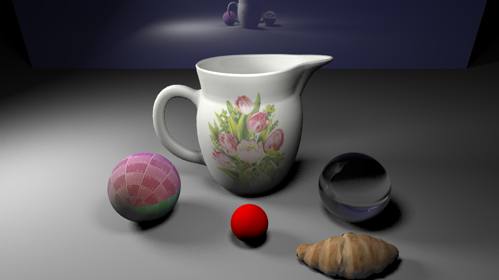

# Olio Ray Tracer

## DEPENDENCIES

* Eigen3
* Boost
* TBB
* OpenMesh 9.0+ (https://www.openmesh.org/)
* jemalloc (Linux only)
* spdlog
* OpenCV
* glm
* glfw
* GLEW

### Installing Dependencies on Ubuntu (20.04):

#### Set Environment Variables:

```
export OLIO_THIRD_PARTY=~/olio_third_party
```

#### Install Dependencies with apt

```
sudo apt install build-essential cmake clang pkg-config libeigen3-dev libtbb-dev libjemalloc-dev libspdlog-dev libboost-dev libboost-program-options-dev libboost-filesystem-dev libboost-system-dev libboost-regex-dev libboost-thread-dev libopencv-dev libglm-dev libglfw3-dev libglew-dev
```

#### Build Rest of Dependencies

```
# OpenMesh
mkdir -p ${OLIO_THIRD_PARTY}/OpenMesh
cd ${OLIO_THIRD_PARTY}/OpenMesh
wget https://www.graphics.rwth-aachen.de/media/openmesh_static/Releases/9.0/OpenMesh-9.0.tar.gz
tar zxf OpenMesh-9.0.tar.gz
cd OpenMesh-9.0.0
mkdir build-release; cd build-release
cmake -DCMAKE_BUILD_TYPE=Release -DCMAKE_EXPORT_COMPILE_COMMANDS=1 ..
make
sudo make install
```


### Installing Dependencies on MacOS:

First, install Xcode from the App Store and Homebrew from https://brew.sh.

#### Set Environment Variables:

```
export OLIO_THIRD_PARTY=~/olio_third_party
```

#### Install Dependencies with apt

```
brew install cmake llvm pkg-config boost eigen tbb opencv spdlog glm glfw glew wget
```

#### Build Rest of Dependencies

```
# OpenMesh
mkdir -p ${OLIO_THIRD_PARTY}/OpenMesh
cd ${OLIO_THIRD_PARTY}/OpenMesh
wget https://www.graphics.rwth-aachen.de/media/openmesh_static/Releases/9.0/OpenMesh-9.0.tar.gz
tar zxf OpenMesh-9.0.tar.gz
cd OpenMesh-9.0.0
mkdir build-release; cd build-release
cmake -DCMAKE_BUILD_TYPE=Release -DCMAKE_EXPORT_COMPILE_COMMANDS=1 ..
make
sudo make install
```

## Build Olio

```
cd olio
mkdir build
cd build
cmake -DCMAKE_BUILD_TYPE=Release ..
make
```

## Scene File Specification

The command file consists of a series of lines which describe geometry, camera, lights, or materials.

Only this last one is context-sensitive: a defined material applies to any geometry that is defined subsequently, until it is replaced by another material definition.

All commands are unique from a single letter - the only variant of this is that the “lights” command (“l”) has a first argument which says which kind of light to make (note also that lights don’t take a material definition - the light color and intensity is encoded in 3 floats).

All points, scalars, or vectors are given as floats, with distances in meters. r/g/b values are encoded as floats with range [0 1] for material colors, and light color and intensity are both encoded in the r g b triple, with minimum 0 and unbounded maximum (although it’s reasonable to choose 1 has a nominal value).

Here are the possible commands:

<u>Comment</u>:

/ Any line starting with / should be ignored

<u>Geometry</u>:

/ sphere at position x y z with radius r: 

s x y z r

/ triangle with counterclockwise point order: 

t x1 y1 z1 x2 y2 z2 x3 y3 z3

/ plane with normal n and scalar value d: 

p nx ny nz d

/ triangle mesh w meshpath

w meshpath

<u>Camera</u>:

/ camera at position [x y z] looking in direction [vx vy vz], with focal length d, / an image plane sized iw by ih (width, height) and number of pixels pw ph.

c x y z vx vy vz d iw ih pw ph

<u>Lights</u>: (note second parameter to denote which kind of light)

/ a point light at position x y z, color & intensity coded as r g b 

l p x y z r g b

/ a directional light with direction vx vy vz and color & intensity coded as r g b 

l d vx vy vz r g b

/ the ambient light (there will be, at most, only one of these): 

l a r g b

<u>Materials</u>:

When a new material is defined, all subsequently-created geometry will be assigned that material.

/ Phong material with solid color:

/ defined by diffuse components [dr dg db], specular components 

/ [sr sg sb], ideal specular components [ir ig ib], and with “roughness” 

/ or Phong exponent “r” 

m dr dg db sr sg sb r ir ig ib


/ textured Phong material:

/ defined by texture id “ti”, diffuse components [dr dg db], specular components 

/ [sr sg sb], ideal specular components [ir ig ib], and with “roughness” 

/ or Phong exponent “r” 

/ (note: the texture referenced by this material must be defined first) 

n ti dr dg db sr sg sb r ir ig ib


/ dielectric Phong material:

/ defined by index of refraction ior and attenuation components [dr dg db] 

d ior dr dg db


<u>Textures</u>:

/ image texture with id “ti” and path “path”.

/ “flipx” and “flipy” are integer values in { 0, 1 } , specifying whether to flip the image / horizontally or vertically, respectively.

i ti flipx flipy path

## How to Run It?

Inside terminal, run `<olio_rtbasic executable> -h` to get help information!

An example of running the ray tracer is displayed below:

`<olio_rtbasic executable> -s data/scenes/jug_croissant_spheres.scn -o test.png -d 5 -a 5`


